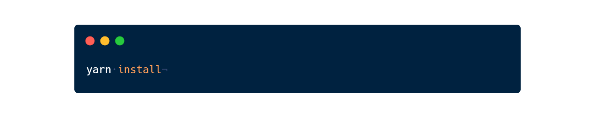
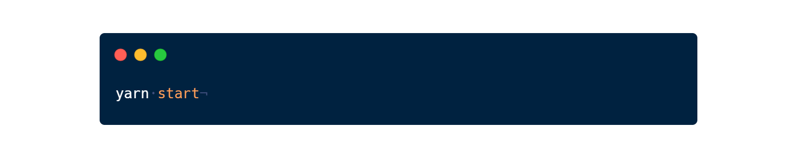
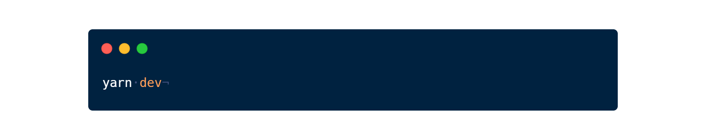

<h1 align="center">Welcome to yNotesAPI 👋</h1>

  
  

> This project is a Rest API to yNotes website, both is for study and learn.

## Install

## Usage

## Run tests

## Author

👤 **Gabriel**

* Website: Coming Soon
* Github: [@gs-nasc](https://github.com/gs-nasc)

## Show your support

Give a ⭐️ if you like this project